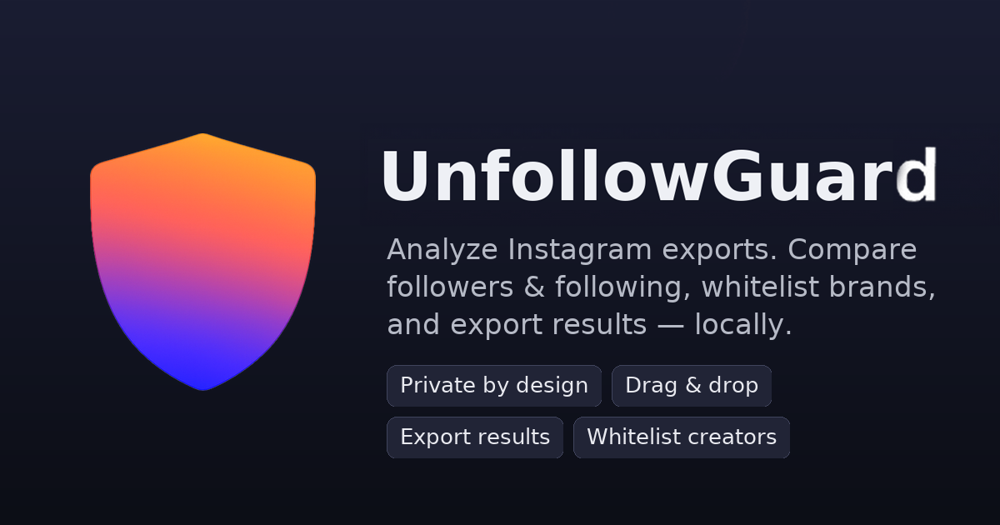



  

**Privacy-first Instagram follower auditor** — compare your *Followers* vs *Following*, whitelist brands/creators, and export results.  
Runs entirely in your browser. No logins. No servers. No tracking.

**Live:** https://www.unfollowguard.com

---

## ✨ Features

- **Drag & Drop** or **Click to Select** your Instagram export files
- **Accurate compare**:  
  - *Not Following You Back*  
  - *You Don’t Follow Back*
- **Whitelist**: exclude brands/creators (persists in local storage)
- **Export** results as `.txt`
- **PWA**: install to your phone/desktop; **offline** support
- **100% client-side**: your data never leaves your device

---

## 📥 What files do I need?

From your Instagram data export, use:

- `followers_*.json` (you can select multiple)
- `following.json`

> Tip: On mobile, save files to Files/iCloud/Drive first; then open the site and import.

---

## 🚀 Quick Start (local)

1. Clone or download this repo.
2. Open `index.html` in your browser (double-click is fine).
3. Drag in `followers_*.json` + `following.json`.
4. Click **Compare Now**.

---

## 🌐 Deploy on GitHub Pages

Already set up for this repo. If you fork:

1. Push `index.html` (in repo root).
2. Repo → **Settings** → **Pages**  
   **Source:** *Deploy from a branch* → **main** / **(root)** → **Save**.
3. Your site: `https://<username>.github.io/<repo>/`

> If you see 404 at first, wait a minute and hard-refresh (Ctrl/Cmd+Shift+R).

---

## 📱 Installable PWA

Add to Home Screen on iOS/Android or “Install App” in desktop Chrome.

---

  

  <b>DVN Ventures LLC</b> 
  Built with care.

📜 License

MIT — do whatever, just don’t hold us liable.

